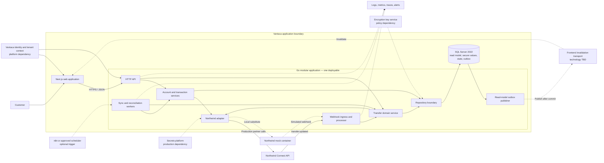

# Engineering Task Issue Drafts

These Markdown files are ready to copy into GitHub issues. They follow the ownership map in [StartHere](../Notes/StartHere.md#delivery-approach) and specify outcomes, constraints, and test evidence while leaving package structure and implementation details to the assigned engineer.

The synthetic interview demo is now implemented under [`Demo/`](../Demo/README.md). These drafts remain the delivery/production work breakdown; they do not authorize production deployment, real credentials/data, or real-money enablement. Each owner must confirm the current phase and applicable decisions in [DECISIONS.md](../AI-Log/DECISIONS.md) before changing production scope.

## Architecture placement and runtime dependencies

The detailed workflow source remains [StartHere.md](../Notes/StartHere.md). This map shows where each application/feature is expected to run and which other applications or platform capabilities it depends on. It is a logical design: local Compose and the Northwind mock are development conveniences, while production hosting, identity, secrets, keys, queues, ingress, and observability must use Vantaca-approved services.

### Feature placement

| Feature | Entry point | Owning runtime boundary | Application dependencies | Primary consumer/output |
|---|---|---|---|---|
| Linked accounts and balances | Next.js account page | Go account service + SQL read model | Vantaca identity, ENG-01 adapter, Northwind/mock, scheduler, SQL Server | Masked account/balance/freshness response |
| Recent transactions | Next.js transaction page | Go account service + async worker + SQL/outbox | ENG-01 adapter, SQL Server, scheduler/job mechanism, invalidation transport | Immediate SQL snapshot, then re-fetch only after committed mismatch |
| ACH transfer submission | Next.js transfer flow | Go transfer domain service + SQL transfer state | Identity/authorization, ENG-01 adapter, Northwind, secure account-value access, feature gate | Definitive or explicitly ambiguous transfer result |
| Transfer webhook | Northwind webhook call | Go webhook ingress/processor + durable state | Approved ingress authenticity, transfer repository, confirmed webhook identity rule, observability | Validated transfer-state change or safe idempotent acknowledgement |
| Transfer reconciliation | Scheduler/operations | Go reconciliation worker | Exact Northwind lookup/correlation, SQL state, scheduler, alerting | Repaired or visibly unresolved transfer state |
| Failure/recovery | Any Northwind operation | Go adapter/application policy + operations | Typed errors, timeout/retry policy, metrics/alerts, runbooks | Bounded retry, stale state, reconciliation, or human action |

### Dependency status

- **Directed application baseline:** Next.js, Go modular application, SQL Server 2022, and a standalone local Northwind mock.
- **External partner dependency:** Northwind production/sandbox contract, credentials, endpoints, quotas, webhook behavior, and support.
- **Vantaca platform dependencies still requiring confirmation:** identity/tenant context, production compute/ingress, secrets, encryption keys, durable job/outbox execution, frontend invalidation transport, observability, CI/CD, and operational ownership.
- **Optional dependency:** n8n may trigger approved workflows but does not own banking rules, partner calls, or direct financial-data mutation.
- **Current runnable local stack:** root Compose starts the implemented Next.js UI, Go Vantaca API, SQL Server 2022 database, and Northwind mock; the optional `automation` profile adds n8n. This is demo evidence, not a claim that unresolved production platform controls exist.

### Shared planning and evidence

- [Engineering delivery analysis](../Notes/Delivery-Plan.md) adds the cross-workstream effort ranges, dependency/parallelization plan, risk ratings, phase exit criteria, QA/observability expectations, AI suitability, human-review levels, and two-week Gantt.
- [QA acceptance matrix](../Notes/QA-Acceptance-Matrix.md) is the working requirement → risk → test → evidence register. Issue completion evidence should reference its stable test IDs.
- [Security and data classification](../Notes/Security-Data-Classification.md) is the proposed control matrix for secrets, financial data, identifiers, telemetry, and synthetic fixtures. Security/Data-owner approval remains required where marked pending.

## Issue index

| Issue | Owner | Primary AI harness |
|---|---|---|
| [EM-01 — Architecture blockers and production readiness](00-integration-lead-delivery-readiness.md) | Engineering Manager / Integration Lead | [EM Delivery](../AI-Harnesses/em-delivery-harness.md) |
| [ENG-01 — Northwind adapter and mock contract](01-northwind-adapter-and-mock.md) | Engineer 1 | [Go Backend](../AI-Harnesses/go-backend-harness.md) |
| [ENG-02 — SQL Server and account/transaction synchronization](02-mssql-account-transaction-sync.md) | Engineer 2 | [Database](../AI-Harnesses/database-harness.md) |
| [ENG-03 — Transfers, webhooks, and reconciliation](03-transfers-webhooks-reliability.md) | Engineer 3 | [Integration Reliability](../AI-Harnesses/integration-reliability-harness.md) |
| [ENG-04 — Customer integration experience](04-nextjs-customer-experience.md) | Engineer 4 | [Frontend](../AI-Harnesses/frontend-harness.md) |
| [QA-01 — Acceptance and production-readiness evidence](05-qa-pm-acceptance-release.md) | QA / PM | [QA](../AI-Harnesses/qa-harness.md) |

## Shared working rules

- Start AI-assisted work with the [Initialization Evaluator](../AI-Harnesses/initialization-evaluator.md), then use the issue's single primary harness.
- Read only the decisions, questions, concerns, interfaces, and tests needed for the assigned issue.
- Treat Northwind as authoritative and Vantaca data as a timestamped read model.
- Never invent partner behavior to close an item in [OPEN-QUESTIONS.md](../AI-Log/OPEN-QUESTIONS.md).
- Use synthetic data only. Never commit credentials, real account details, or sensitive payloads.
- Keep the issue's sample data aligned with the supplied Northwind guide and deterministic mock; samples illustrate shape and behavior but do not settle unresolved partner semantics.
- Trace implementation and tests to the architecture workflow logic named in the issue.
- Keep demo evidence separate from Northwind certification and production approval.
- Return architecture-changing, security, financial-risk, and scope decisions to the Integration Lead.
- Within those boundaries, owners choose package/component structure, naming, task decomposition, and implementation approach; propose material design changes rather than treating this issue text as a code recipe.

## Shared definition of done

An issue is complete when its acceptance criteria pass, required automated/manual evidence is attached, relevant documentation is updated, sensitive values are absent from logs/fixtures, and the owning engineer plus QA/PM have reviewed the result. Passing mock tests alone is not production-readiness approval.
