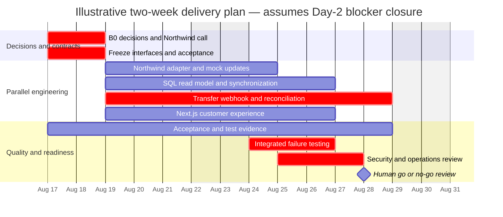

# Engineering Delivery Analysis and Phase Gates

## Purpose

This document turns the discovery architecture into an engineering-management delivery view. It adds the estimates, dependency order, parallelization, risk, QA, observability, definition-of-done, AI-suitability, and human-review fields required by the original exercise.

It is a planning artifact, not authorization to implement or launch. Estimates are ranges, unresolved Northwind/Vantaca decisions remain blockers, and accountable humans—not an AI tool or the schedule—own risk acceptance and production approval.

## Planning basis

- **Target window:** ten business days beginning Monday, August 17, 2026.
- **Assumed team:** one Engineering Manager/Integration Lead, four engineers aligned to ENG-01 through ENG-04, and one QA/PM.
- **Estimate unit:** focused person-days of remaining work, not elapsed calendar days or a commitment.
- **Existing baseline:** the deterministic Northwind mock and root Compose startup are already implemented; the Vantaca API, UI, SQL persistence, workers, and production platform integration are not.
- **External lead time:** Northwind responses, Security review, and platform provisioning are not included as engineering effort. They are gating elapsed-time dependencies.
- **Scope control:** read-only account/transaction capability and transfer-write capability must remain independently feature-gated.

The combined engineering estimate is **35–52 person-days**, plus external decision and provisioning lead time. The work can fit a two-week elapsed window only through parallel ownership, answers to B0 questions by Day 2, a stable contract, and active integration/QA from Day 1. ENG-03 exceeds one engineer's ten-day capacity at the upper bound; it needs pairing, prior reusable platform components, or removal of transfer-write scope.

## Workstream delivery matrix

Risk ratings combine customer/financial impact, contract uncertainty, and schedule exposure. “Production blocker” means the named outcome must either pass or be explicitly removed/disabled from GA scope.

| Workstream | Accountable owner | Remaining effort | Hard dependencies | Parallelization and critical path | Risk | Production blocker |
|---|---|---:|---|---|---|---|
| **EM-01 — Architecture blockers and readiness** | Engineering Manager / Integration Lead | 6–8 person-days across the window | Product, Security, Operations, platform owners, Northwind architects; B0/B1 register | Starts immediately and coordinates every stream. B0 contract/policy closure by Day 2 is the critical path. | **High** — decisions can invalidate schema, workflow, or launch scope | Yes: scope, owners, go/no-go evidence, rollback/kill switch, and accepted residual risk |
| **ENG-01 — Northwind adapter and contract** | Engineer 1 | 4–6 person-days | Reviewed Northwind schemas, credentials/environment, paging, rate-limit and error semantics; mock baseline | Can start with the mock and written assumptions. Interface freeze unblocks ENG-02/03; contract changes ripple across all streams. | **Medium–High** — partner drift and undocumented behavior | Yes for any enabled Northwind capability |
| **ENG-02 — SQL Server and synchronization** | Engineer 2 | 6–9 person-days | Tenant/account identity, Security data policy, ENG-01 DTO contract, SQL/key/job platform | Schema/read model can start after Day-2 decisions and run beside ENG-03/04. Secure-value design and transaction comparison are critical. | **High** — tenant isolation, financial precision, encryption, concurrency | Yes for account/transaction reads and as a prerequisite for transfers |
| **ENG-03 — Transfers, webhooks, reconciliation** | Engineer 3, with Lead/Security pairing | 8–12 person-days | ENG-01, ENG-02 transfer state, authorization, exact idempotency/correlation, webhook authenticity, scheduler/alerts | Domain state can start in parallel; safe submission and trusted webhook paths cannot finish before B0 Northwind/Security answers. Primary transfer critical path. | **Critical** — duplicate money movement and ambiguous outcomes | Yes for transfer-write only; disable transfers if unmet |
| **ENG-04 — Next.js customer experience** | Engineer 4 | 5–8 person-days | Identity/tenant context, stable Go contracts, Product freshness/error wording, ENG-02/03 state shapes | Shell and fixture-driven states can begin early. Final wiring follows API contracts; transfers remain behind a separate flag. | **Medium–High** — misleading financial state or duplicate user actions | Yes for customer-facing scope; transfer UI does not enable transfer backend |
| **QA-01 — Acceptance and release evidence** | QA / PM | 6–9 person-days across the window | Signed scope/semantics, test environments, evidence from every engineer, Security/Ops reviewers | Begins Day 1 with traceability and runs continuously. Integrated failure/rollback evidence is a final critical-path activity. | **High** — missing evidence can conceal release risk | Yes: no GA without an approved evidence package and human go/no-go |

## Evidence, AI, and review matrix

**AI suitability** reflects whether an AI harness can accelerate bounded work using synthetic data. It does not authorize unsupervised changes. **Human review level** is:

- **H1:** normal peer review.
- **H2:** senior/domain-owner review plus QA evidence.
- **H3:** accountable Product/Security/Operations approval in addition to engineering and QA.

| Workstream | QA strategy | Required observability | Definition of done | AI suitability | Human review |
|---|---|---|---|---|---|
| **EM-01** | Trace every launch requirement and blocker to owner, decision, evidence, and phase gate; run failure/rollback table-tops | Daily blocker aging, readiness status, residual-risk register, named escalation path | B0/B1 outcomes recorded; scope and flags frozen; runbooks/evidence indexed; go/no-go held; no unresolved risk silently accepted | **Medium:** useful for matrix maintenance, dependency checks, and contradiction review; not for stakeholder decisions | **H3** — EM, Product, Security, QA, Operations |
| **ENG-01** | Unit and contract tests for auth placement, DTO normalization, pagination, optional fields, exact money, 4xx/5xx/429/latency/timeout behavior | Partner latency/error/rate-limit metrics, retry counts, correlation ID, schema/unknown-enum alarms without sensitive payloads | Adapter passes reviewed contract tests against mock and approved sandbox; retry rules are bounded; no mock-only controls leak into production code | **High:** good for adapters, fixtures, and test generation using the [Go harness](../AI-Harnesses/go-backend-harness.md) | **H2** — backend peer, Integration Lead, QA; Northwind contract review |
| **ENG-02** | Migration/repository integration tests; tenant-negative tests; precision, concurrency, comparison, commit-before-publish, restore/key-rotation evidence | Sync age/lag, job outcome/duration, row/change counts, outbox backlog, SQL errors/deadlocks, protected-data access audit | Migrations and rollback reviewed; tenant-scoped views work; secure fields follow approved policy; transaction refresh is idempotent and publishes only after commit | **Medium–High:** good for schema/test drafts with the [Database harness](../AI-Harnesses/database-harness.md); never provide real data/keys | **H3** — database owner, Security/Data owner, backend peer, QA |
| **ENG-03** | State-machine/property tests; duplicate-click/event tests; post-commit timeout; out-of-order/late event; exact reconciliation; outage recovery | Submission outcome, ambiguous age, state transitions, inbox duplicates/rejections, reconciliation lag/failure, kill-switch state; alerts for unresolved money movement | Durable intent precedes partner call; no unsafe automatic retry; allowed transitions enforced; trusted events/reconciliation converge; exceptions have a runbook and owner | **Medium:** helpful for exhaustive cases with the [Reliability harness](../AI-Harnesses/integration-reliability-harness.md); unsafe to delegate financial policy or release judgment | **H3** — senior backend, Integration Lead, Security, Product/Risk, QA, Operations |
| **ENG-04** | Component and accessibility tests; API-state fixtures; end-to-end stale/error/duplicate-submit/lifecycle tests; no direct Northwind calls | Web/API error rates, stale-state display, refresh/invalidation outcomes, duplicate-submit suppression; no financial values in analytics | Tenant-authorized UI uses Vantaca API only; freshness/as-of/error states are explicit; transfer states and feature flags are correct; accessibility and responsive checks pass | **High:** good for components and fixture-driven tests with the [Frontend harness](../AI-Harnesses/frontend-harness.md); Product wording needs review | **H2**, elevated to **H3** for transfer/freshness UX — frontend peer, Product, QA/accessibility |
| **QA-01** | Maintain [requirement → risk → test → evidence](QA-Acceptance-Matrix.md); risk-based exploratory, failure, security, load-boundary, and rollback exercises | Evidence links to dashboards/alerts/runbooks; test and defect trends; blocker age; environment/build identity | Every in-scope requirement has accepted evidence; open defects/residual risks are visible; rollback and support readiness are exercised; approvers sign or stop | **High:** useful for test design and traceability using the [QA harness](../AI-Harnesses/qa-harness.md); AI-generated evidence is not proof | **H3** — QA coordinates; accountable owners make release decision |

## Delivery phases and exit criteria

Phases are evidence gates, not interchangeable names. The current repository is at **Prototype/Demo** for the Northwind substitute and at architecture/readiness for the Vantaca application.

| Phase | Purpose and included scope | Required entry | Exit criteria and evidence | Explicit exclusions / stop conditions |
|---|---|---|---|---|
| **Prototype / Demo** | Demonstrate synthetic Northwind account, transaction, transfer, status, webhook, and failure shapes; validate architecture conversations | Supplied guide, documented assumptions, synthetic fixtures | Root Compose starts the mock; unit/handler checks pass; walkthrough is repeatable; limitations clearly distinguish mock from production | No real customer data, Vantaca UI/API/SQL claim, partner certification, production security, or money movement |
| **Integration MVP** | Implement vertical account/transaction read slice against mock and approved sandbox; optionally build transfer state behind a disabled flag | B0-2 identity direction, initial Product scope, reviewed API schemas, dev/test platform | Tenant-isolated API/read model works; bounded sync and stale/error behavior pass; contract and SQL integration evidence exists; all transfer calls remain non-production | Stop if customer/account binding, secure-data policy, or supported partner environment is missing |
| **Pilot / Limited Rollout** | Exercise production-like read paths for named internal/limited tenants; transfer path only if every transfer B0 gate is closed | MVP evidence, Security-approved environment, operational owners, pilot limits, support and rollback plan | Soak/load boundary and failure recovery meet agreed limits; dashboards/alerts/runbooks work; reconciliation has no unexplained deltas; pilot feedback accepted | No broad availability; cap tenants/volume; kill transfer flag for ambiguous or unauthenticated behavior |
| **Production Candidate** | Frozen release candidate with complete in-scope behavior and production configuration | Pilot exit met, Northwind production contract, all B0/B1 decisions, change freeze | Full [QA matrix](QA-Acceptance-Matrix.md) has accepted evidence; security review and restore/rollback exercise pass; open risk has named approver; go/no-go packet complete | No unresolved stop-ship issue, unknown deployment owner, untested rollback, or unowned financial exception |
| **Production GA** | Deliberately release the approved feature set with support and monitoring | Human go/no-go by Engineering, Product, Security, QA, and Operations | Feature flags deployed progressively; health/reconciliation observed; support and partner escalation active; post-launch review scheduled | Transfer-write stays disabled if idempotency, exact lookup, webhook trust, authorization, or operational control is incomplete; schedule pressure is not a waiver |

## Illustrative two-week sequence

This schedule shows dependency order, not a guarantee. It assumes B0 answers and platform paths are available by the end of Day 2 and that engineers integrate continuously.

### Sequence interpretation

- **Days 1–2:** close architecture-changing questions, freeze the minimum interface, establish acceptance evidence, and pre-authorize the read-only fallback.
- **Days 3–7:** build adapter, persistence/sync, transfer reliability, and UI tracks in parallel; merge vertical slices continuously.
- **Days 6–9:** run integrated contract, database, lifecycle, failure, security, accessibility, and load-boundary checks as features land.
- **Days 9–10:** freeze the candidate, exercise rollback/kill switches/runbooks, review residual risk, and hold a human go/no-go.
- **If Day-2 blockers remain open:** do not compress security or correctness work. Disable the affected capability, reduce scope to an approved read-only release, or move the date.

## Daily control loop

1. EM/Lead reviews B0/B1 owner, due date, latest evidence, and scope impact.
2. Engineers publish test results and changed assumptions with each integration.
3. QA updates the traceability matrix and flags requirements with no executable evidence.
4. Security/Operations review only the newly ready controls and runbooks instead of waiting for the final day.
5. Any financial ambiguity, cross-tenant exposure, secret leakage, unsupported partner behavior, or failed rollback stops promotion and activates the relevant feature gate.

## Production readiness decision

A production release requires more than completing issue checklists. The final decision must confirm:

- all enabled capabilities meet their phase exit criteria;
- every B0/B1 item is closed with evidence or removed from scope;
- the [security/data-classification controls](Security-Data-Classification.md) are approved and verified;
- the [QA traceability matrix](QA-Acceptance-Matrix.md) identifies the tested build/environment and accepted evidence;
- dashboards, alerts, reconciliation, runbooks, rollback, and support ownership are live;
- residual risk is accepted by the accountable Product, Security, Engineering, QA, and Operations representatives.

Passing the local mock or reaching the calendar date is not production approval.
