# Vantaca × Northwind Integration — Start Here

## Purpose

This is the short orientation document for the interview project. It summarizes the current direction and the next decisions without duplicating the full evidence registers.

For detail, use:

- [Open questions](../AI-Log/OPEN-QUESTIONS.md) for ranked B0/B1 launch blockers and future work.
- [Decisions](../AI-Log/DECISIONS.md) for Integration Lead-approved direction.
- [Concerns](../AI-Log/CONCERNS.md) for risk, ownership, and production impact.
- [Delivery plan](Delivery-Plan.md) for effort, dependencies, parallelization, phase gates, and the two-week sequence.
- [QA acceptance matrix](QA-Acceptance-Matrix.md) for requirement-to-risk-to-test-to-evidence traceability.
- [Security/data classification](Security-Data-Classification.md) for proposed handling and unresolved policy approvals by data class.
- [Questions and comments](Questions-Comments.md) for informal working notes.

`Questions-Comments.md` contains informal discovery analysis. Material current questions are normalized in `AI-Log/OPEN-QUESTIONS.md`, and Integration Lead-approved direction is recorded in `AI-Log/DECISIONS.md`; use those logs when working notes and current direction differ.

> **Architecture documentation boundary:** Keep Major Workflows 1–6 and their explanations in this file. If StartHere is later shortened, relocate the complete workflow diagrams, descriptions, and architectural decisions to `Notes/Architecture.md` and leave a clear link here; do not delete them.

## Current position

> **Mode:** RUNNABLE INTERVIEW DEMO. The Next.js UI, Go Vantaca API, SQL Server read/operational model, Northwind mock, and optional n8n trigger are implemented under [`Demo/`](../Demo/README.md). Production deployment and real-money enablement are not authorized.
>
> **Target:** Production-ready go-live in two weeks.
>
> **Assessment:** The synthetic demo exercises the chosen boundaries and key failure semantics. The date remains a planning baseline and does not waive financial-integrity, security, correctness, QA, or operational gates.

Northwind remains the authoritative financial system. Vantaca should maintain a timestamped read model for fast display, not claim that a cached balance is continuously identical to Northwind. Customers and third parties may change the account outside Vantaca.

Read-only account functionality and transfer-write functionality should be independently feature-gated. If safe transfer correlation is unavailable, the pre-agreed fallback is a read-only launch only when the remaining read-path blockers are resolved and Product approves it.

## Directed technology and boundaries

- Go modular monolith with explicit transport, application/domain, repository, and Northwind-adapter boundaries.
- Next.js, TypeScript, and Tailwind for the customer-facing demonstration.
- SQL Server 2022 with `database/sql`, parameterized raw SQL, and deterministic migrations.
- Local deterministic Northwind mock for development and failure testing.
- Optional n8n profile for recurring orchestration; Go owns selection, batching, rate control, persistence, and banking rules.
- Northwind DTOs remain inside the adapter.
- Demo topology and production deployment requirements remain explicitly separate.

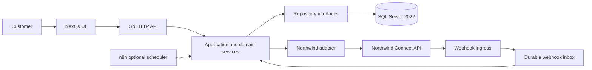

## Immediate two-week critical path

### Internal Vantaca decisions — resolve asynchronously

| Order | Decision                                                                                                                                                     | Accountable owners                | Default if unresolved                                                                              |
| ----- | ------------------------------------------------------------------------------------------------------------------------------------------------------------ | --------------------------------- | -------------------------------------------------------------------------------------------------- |
| 1     | Define acceptable balance mismatch/staleness, as-of wording, refresh behavior, and unavailable-state UX.                                                     | Product, Risk, QA                 | Do not describe cached balances as live; do not launch the balance view without approved behavior. |
| 2     | Identify the Vantaca customer, tenant, consent, linked-account, entitlement, and step-up-authentication owners.                                              | Engineering, Product, Security    | No account access or transfers.                                                                    |
| 3     | Approve the fallback when Northwind cannot support safe transfer idempotency and lookup.                                                                     | Product, Integration Lead         | Keep transfer submission disabled.                                                                 |
| 4     | Approve or reject compensating controls for query-string credentials, unsigned webhooks, and full account-number storage.                                    | Security, Compliance              | Treat as stop-ship.                                                                                |
| 5     | Name the production platform and operational owners for secrets, ingress, SQL Server, durable processing, monitoring, reconciliation, support, and rollback. | Engineering, Security, Operations | No production-readiness approval.                                                                  |
| 6     | Freeze the exact launch scope and risk-ranked release evidence.                                                                                              | Product, QA, Integration Lead     | Do not infer scope from the deadline.                                                              |

### Northwind live architecture call — protect the time

Use the call to obtain five architectural outcomes:

1. **Balance contract:** ledger/current/available meaning, pending activity, precision, source timestamp, multi-channel propagation delay, consistency, supported polling, and real throttling.
2. **Transfer safety:** idempotency/client reference and an exact lookup mechanism after an ambiguous timeout.
3. **Webhook identity and delivery:** whether `transfer_id` is a stable and safe consumer idempotency key, whether a status or separate event ID must be included, plus retry identity, ordering, replay, timestamps, and a verifiable authenticity control.
4. **Customer/account scope:** linking, consent, ownership, revocation, and the identity carried on each request.
5. **Production boundary:** supported environments, credentials, endpoints, transfer semantics, SLA, and escalation.

Do not spend Northwind call time asking it to decide Vantaca UX wording, acceptable balance mismatch, internal authorization, retention, deployment, n8n, alerts, staffing, or risk acceptance.

Request precise schemas, quotas, IP ranges, environment setup, pagination rules, transfer limits/statuses, and support procedures as one written follow-up after the call.

## Financial-safety rule

A failed HTTP exchange does not prove a transfer was not created. Vantaca can prevent repeated inbound clicks with its own request ID, but only Northwind can make a post-commit timeout safely recoverable through partner-supported idempotency and exact correlation.

```mermaid
sequenceDiagram
    autonumber
    actor Customer
    participant UI as Next.js UI
    participant App as Vantaca Go service
    participant DB as SQL Server
    participant NW as Northwind

    Customer->>UI: Confirm transfer
    UI->>App: Submit with Vantaca request ID
    App->>DB: Persist local transfer intent
    App->>NW: POST transfer

    alt Definitive Northwind response
        NW-->>App: Transfer ID and PENDING status
        App->>DB: Record partner ID and state
        App-->>UI: Accepted and pending
    else Timeout or response lost
        Note over App,NW: Timeout or response lost; partner outcome is unknown
        App->>DB: Mark UNKNOWN
        App-->>UI: Submission needs verification
        Note over App,NW: Do not automatically resubmit without proven partner idempotency
    end
```

Webhooks are notifications, not sufficient proof by themselves. The documented payload includes `transfer_id`, which may be a valid consumer idempotency/deduplication key; that capability must be confirmed rather than assumed absent. Ask whether `transfer_id` is globally unique and stable, whether legitimate status changes can reuse it, whether `(transfer_id, status)` is the intended key, or whether Northwind provides a separate event/delivery ID. Persist webhook input durably, validate permitted transitions, and reconcile with Northwind. Do not confuse webhook-processing idempotency with idempotency for `POST /transfers`; they solve different failure modes.

## Application Architecture

The demo implements this deliberately simple shape.

I would start with a **modular application architecture rather than multiple microservices**. The Go application owns the business and integration logic, Next.js owns the customer experience, MSSQL stores our application state, and n8n provides optional operational orchestration for scheduled/reconciliation workflows.

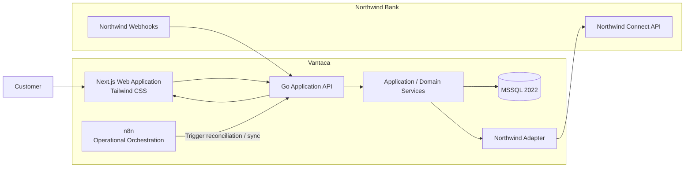

The Northwind adapter is shown separately because it represents an important architectural boundary, but it does **not** need to be a separate deployed microservice.

Northwind-specific DTOs, errors, authentication behavior, retry policies, and contract quirks remain behind that adapter instead of leaking throughout the application.

### Local Development / Interview Demonstration

For development and the interview demonstration, the repository includes a lightweight Northwind mock:

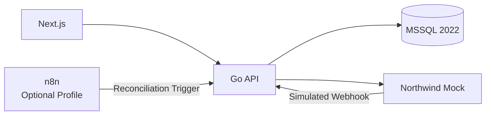

The mock allows the team to build and test independently of Northwind and gives QA deterministic control over scenarios such as:

- successful transfers;

- failed transfers;

- returned transfers;

- `429`;

- `500`;

- `503`;

- slow responses;

- timeouts;

- duplicate webhook delivery.

## Major Workflow 1 --- Account and Balance Synchronization

This workflow builds the local account-and-balance read model used by the customer experience. Synchronization is decoupled from the browser request so Northwind latency or an outage does not make every page load wait on the partner.

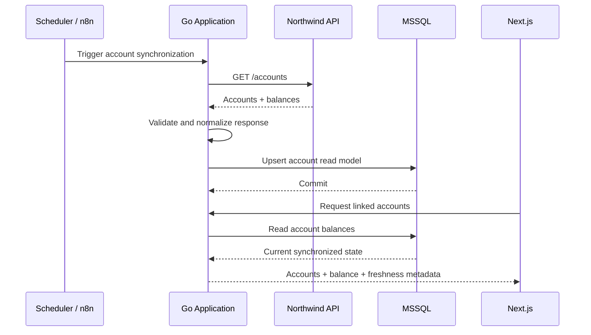

How it works:

1. An approved scheduler starts a bounded synchronization run; n8n is one optional trigger, while the Go application owns selection, partner calls, validation, and persistence.
2. The Northwind adapter fetches linked accounts, validates the response, and maps partner DTOs into Vantaca's internal account model.
3. The application transactionally upserts the account snapshot and its fetched-at metadata in SQL Server.
4. Next.js requests linked accounts from the Go API, which reads the committed SQL view and returns balances with explicit freshness information. The frontend never calls Northwind directly.

If a sync fails, retain the last known snapshot, record the failed attempt, and present the Product-approved stale or unavailable state; never replace known balances with an empty response. The polling frequency is intentionally not hardcoded until Product's freshness requirement, Northwind's supported quota, and expected customer volume are understood.

## Major Workflow 2 --- Recent Transactions

This workflow uses a fast local read followed by asynchronous reconciliation. The initial customer request returns the current SQL Server snapshot and freshness metadata without waiting for Northwind. A background worker then compares the same bounded “recent” transaction window with Northwind, which remains authoritative.

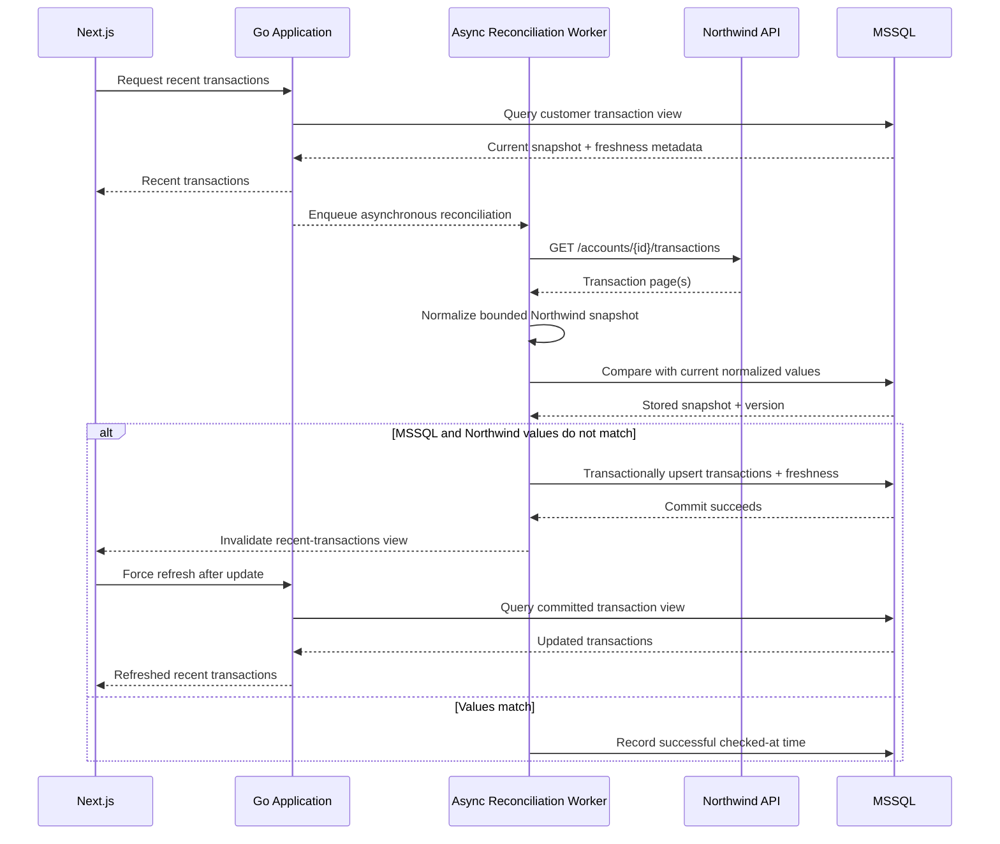

How it works:

1. The Go API reads the customer-scoped recent-transactions view in SQL Server and immediately returns it with fetched-at/stale metadata.
2. The API schedules a bounded, coalesced background reconciliation for that linked account. Repeated page loads should not create unbounded partner calls.
3. The worker retrieves the agreed recent window from Northwind, follows every required page, normalizes partner DTOs, and compares stable customer-visible values rather than raw array order.
4. In the `alt` mismatch branch, the worker commits the SQL update first. Only after that commit succeeds does it publish an invalidation that forces Next.js to re-fetch the Vantaca API and read the updated SQL view.
5. If values match, the worker updates only the checked-at metadata and does not notify the frontend, preventing a refresh loop.

The invalidation is a change signal, not a financial payload; the browser still reads data only through the Vantaca API. Its transport—server-sent events, WebSocket, framework cache invalidation, or bounded client polling—remains an implementation choice. If Northwind fails or SQL cannot commit, preserve the last known snapshot, expose the approved stale state, retry asynchronously according to policy, and do not force a frontend refresh. The definitions of “recent,” stable ordering, corrections, and Northwind transaction-ID guarantees remain explicit open questions.

## Major Workflow 3 --- ACH Transfer Submission

This is the highest-risk workflow and should be intentionally conservative.

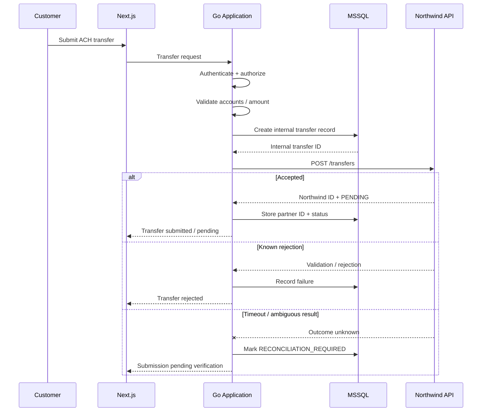

How it works:

1. The API authenticates the customer, verifies tenant/account authorization, validates the amount and routing fields, and persists a Vantaca transfer intent before contacting Northwind.
2. A definitive acceptance stores Northwind's transfer ID and `PENDING` state; a definitive rejection records the known failure and returns a safe customer message.
3. A timeout or lost response is an ambiguous monetary outcome: Northwind may have committed the transfer even though Vantaca did not receive the response. The application records `RECONCILIATION_REQUIRED`/`UNKNOWN` and tells the customer that verification is pending.

The critical distinction is that a timeout does **not** automatically mean the transfer failed. Do not submit the transfer again unless Northwind confirms a durable submission idempotency key/client reference and an exact lookup mechanism. Vantaca's request ID can suppress repeated customer clicks, but it cannot by itself deduplicate a transfer already committed by Northwind.

### Transfer lifecycle state model

The submission workflow above describes how a transfer enters the system; this state model makes the longer-lived behavior explicit. `UNKNOWN / RECONCILIATION_REQUIRED` is an internal Vantaca state for an ambiguous exchange, not a claimed Northwind status. It deliberately has no automatic resubmission path.

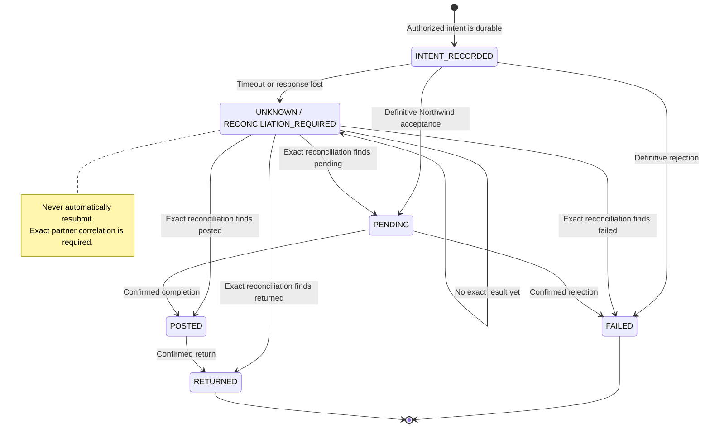

State interpretation:

- `INTENT_RECORDED` proves Vantaca durably captured an authorized request; it does not claim Northwind accepted it.
- `PENDING` means accepted but incomplete. The customer experience must not label it successful or final.
- `POSTED` is a confirmed completion but is not permanently terminal because Northwind documents that a transfer may later become `RETURNED`.
- `FAILED` is a definitive rejection/failure. `RETURNED` is a confirmed later return; both retain immutable history and approved reason details.
- `UNKNOWN` remains open until an exact partner correlation resolves it or Operations handles the documented exception. Similar amount/date/account matching is not exact reconciliation.

Northwind still needs to confirm the complete transition, reason-code, event-time, cancellation, and ordering contract. Webhooks and reconciliation may propose the same transition concurrently; transactional state/version checks must make the result repeatable and preserve legitimate later states.

## Major Workflow 4 --- Transfer Webhook Processing

This workflow turns a partner notification into a controlled state-transition attempt. A webhook is persisted and evaluated against the current transfer state; it does not bypass authentication, schema validation, transition rules, or later reconciliation.

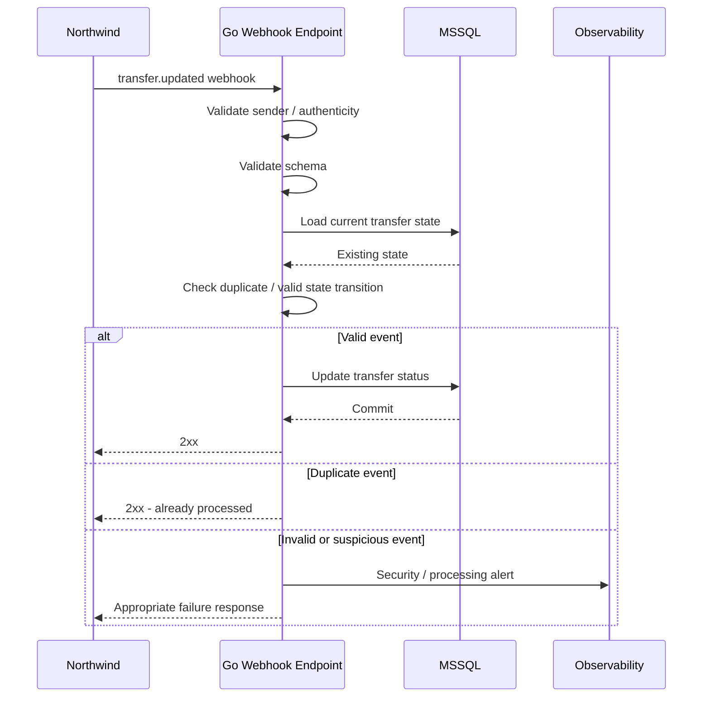

How it works:

1. The ingress applies the Security-approved authenticity control, validates the schema, and durably records enough delivery information for audit/recovery before advancing customer-visible state.
2. The processor locates the transfer, checks the current status, applies the confirmed webhook identity rule, and permits only valid state transitions.
3. A valid new event commits the state change before returning `2xx`. An idempotent retry returns `2xx` without applying the transition again. Suspicious or invalid input is quarantined/alerted and receives the response required by the agreed retry policy.

The payload's `transfer_id` may be the safe consumer idempotency key, but that is a question for Northwind—not an assumption that webhook idempotency is absent. Because one transfer can have more than one legitimate status change, confirm whether the supported identity is `transfer_id`, `(transfer_id, status)`, or a separate event/delivery ID and whether it remains stable across retries. This consumer key is separate from idempotency for creating a transfer through `POST /transfers`.

## Major Workflow 5 --- Transfer Reconciliation

Webhook processing alone should not be our only mechanism for discovering transfer state.

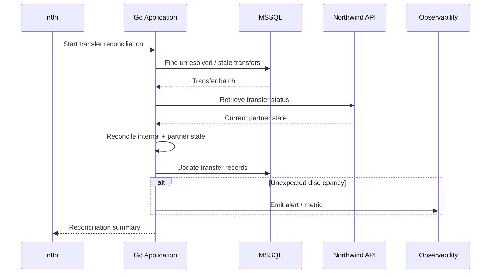

How it works:

1. An approved scheduler starts a bounded job; the Go application selects unresolved, stale, or otherwise reconciliation-eligible transfers from SQL Server.
2. The adapter obtains authoritative partner status using Northwind's supported exact lookup or a safely paginated/correlated alternative.
3. The application compares the partner and internal state machines, commits permitted updates, records reconciliation timestamps, and emits metrics or alerts for impossible transitions and unresolved discrepancies.
4. The scheduler receives an operational summary, while domain decisions and state changes remain inside Go rather than in n8n.

This workflow complements webhook processing: it recovers missed/delayed notifications and ambiguous submissions instead of trusting one delivery path. The exact Northwind lookup mechanism remains a blocker because the current documentation does not define `GET /transfers/{id}`, a client reference, or another deterministic correlation method. Without one, reconciliation must not guess which financial transfer matches an ambiguous submission.

## Major Workflow 6 --- Northwind Failure / Recovery

This decision tree classifies failures by operation safety. Retry policy depends on whether the request is a read with no financial side effect or a transfer submission whose outcome may be unknown.

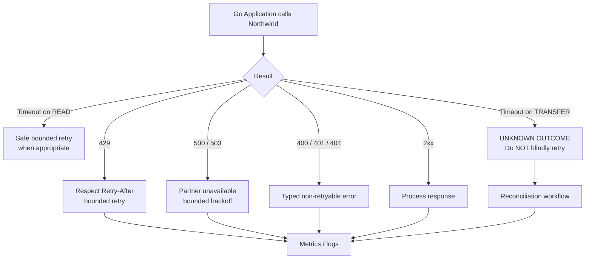

How it works:

1. Successful responses continue through normal validation and persistence. Known `400`, `401`, and `404` responses become typed non-retryable outcomes, with authentication failures also triggering the appropriate operational escalation.
2. `429` honors `Retry-After`; `500` and `503` use bounded backoff. All retries have attempt/time budgets, jitter where appropriate, cancellation, and sanitized telemetry.
3. A timed-out idempotent read may be retried within policy. A timed-out transfer submission is marked `UNKNOWN` and routed to reconciliation rather than blindly resubmitted.
4. Metrics and logs capture endpoint, latency, status class, retry count, stale age, and reconciliation outcome without API keys, full account numbers, or unnecessary financial payloads.

When retry safety cannot be proven, the default is to stop automatic mutation and surface the condition for reconciliation or human review. This prevents availability logic from creating duplicate financial movement.

## Delivery Approach

While the questions above are being worked with Northwind and Product, development can continue through parallel workstreams:

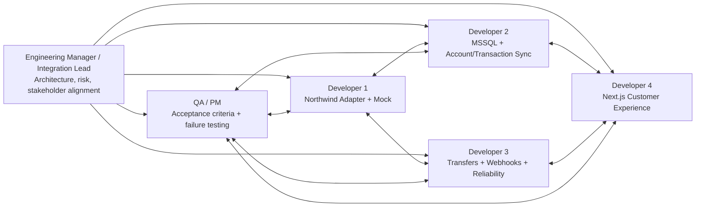

Local GitHub issue drafts for each role are indexed in [EngineeringTasks](../EngineeringTasks/README.md). The index includes a runtime/application dependency map, and each issue identifies where its feature lives, what calls it, its platform/application dependencies, and its outputs while leaving internal implementation details to the assigned engineer.

The companion [delivery plan](Delivery-Plan.md) supplies the complete EM matrix—effort ranges, dependencies, parallelization, risk, QA, observability, definitions of done, production blockers, AI suitability, and human-review levels—plus phase-by-phase exit criteria and the two-week sequence. QA owns the working [acceptance/evidence matrix](QA-Acceptance-Matrix.md), while Security/Data owners review the consolidated [data-classification matrix](Security-Data-Classification.md). These artifacts refine the workstreams without replacing the architecture workflows above.

## Production launch gate

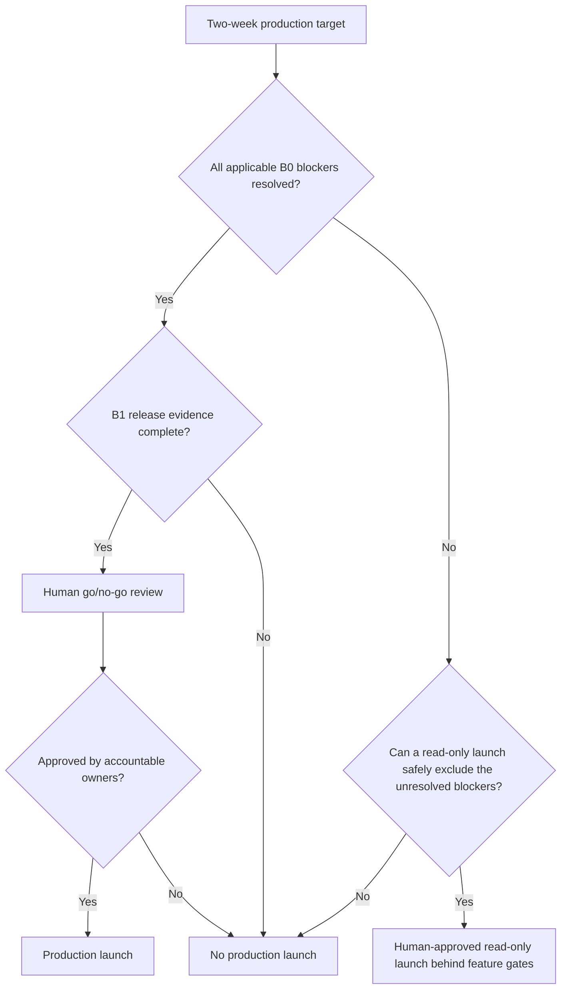

A schedule, mock demonstration, passing happy-path test, or AI recommendation is not production approval. Accountable Product, Security, QA, Engineering, and Operations owners must accept the evidence and residual risk.

## Work that can wait only with safe interim controls

- Cursor/delta synchronization, bulk reads, and balance-change events.
- Higher-volume durable queue/job infrastructure.
- Longer-term SLO/error-budget tuning and capacity models.
- Signed-webhook/replay improvements beyond any launch-approved compensating control.
- Tokenized account references instead of full account data.
- Formal contract-version/deprecation automation.
- Optional n8n production adoption.
- Generalized multi-bank connector abstractions.

Deferral requires a bounded launch limit, observable behavior, named owner, and an extension point that avoids a rewrite.

## Recommended next actions

1. Resolve the internal B0 decisions in parallel and record outcomes in `AI-Log/DECISIONS.md`.
2. Send Northwind the written artifact checklist before or immediately after the architecture call.
3. Hold the focused architecture call and update `AI-Log/OPEN-QUESTIONS.md` with answers and owners.
4. Confirm read/write feature-gate policy and production exit evidence.
5. Authorize DESIGN mode only after architecture-changing B0 answers are known or explicit assumptions and stop conditions are approved.
