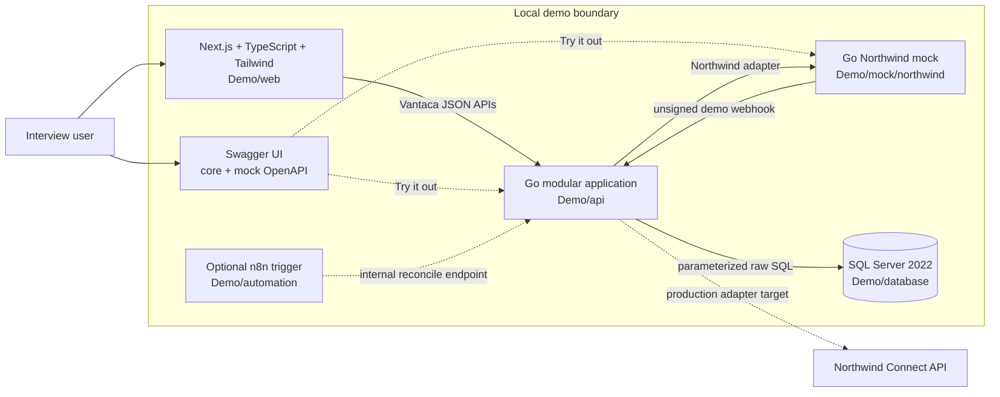

# Vantaca × Northwind Connect Integration

This repository is a discovery-to-demo package for adding Northwind-linked accounts, recent transactions, and ACH-transfer tracking to Vantaca. It now includes a complete synthetic interview demo: a Next.js customer experience, a Go application API, SQL Server 2022 migrations and read model, a deterministic Go Northwind mock, and optional n8n orchestration.

> **Current phase:** runnable integration demo; not a production release.  
> **Target:** a production-ready path in two weeks only if the documented partner, Product, Security, platform, QA, and Operations gates close.  
> **Safe fallback:** release read-only account/transaction functionality and keep transfer submission disabled.

## Five-minute reviewer path

1. Start the stack with `docker compose up --build -d --wait`.
2. Open `http://localhost:13000` and confirm the SQL-backed account snapshot.
3. Open the linked API explorer at `http://localhost:18090`. Its definition selector exposes both the core Vantaca demo API and the Northwind mock contract, including request/response examples and executable operations.
4. Select the checking account and use **Simulate external deposit**. The page returns its existing SQL snapshot immediately, then refreshes after an asynchronous Northwind comparison commits a changed version.
5. Run a `503` account sync. The last good snapshot remains visible and freshness becomes degraded; select the normal behavior and run it again to recover.
6. Create a normal transfer, deliver two `POSTED` webhooks, then return it. The durable inbox accepts the first event and safely collapses the duplicate.
7. Create a transfer with **post-commit timeout**. The mock creates it, the application records `UNKNOWN`, and a repeated Vantaca request does not issue a second partner POST.
8. Use [StartHere](Notes/StartHere.md) for the full architecture, [Delivery Plan](Notes/Delivery-Plan.md) for the two-week path, and [QA Acceptance Matrix](Notes/QA-Acceptance-Matrix.md) for release evidence.

## Quick start

Prerequisite: Docker Desktop or another Docker Compose-compatible runtime.

```powershell
docker compose up --build -d --wait
docker compose ps
```

| Surface | Default address | Purpose |
|---|---|---|
| Interview UI | `http://localhost:13000` | Main walkthrough and deterministic failure controls |
| Swagger API explorer | `http://localhost:18090` | Select and execute the core or mock OpenAPI contract |
| Vantaca demo API | `http://localhost:18080/healthz` | Go API and health endpoint |
| Northwind mock | `http://localhost:8081/healthz` | Synthetic partner contract |
| SQL Server | `localhost:14330` | Local durable read/operational state |

The exact checked-in contracts are also served directly at `http://localhost:18080/openapi.yaml` and `http://localhost:8081/openapi.yaml`. In Swagger's **Authorize** dialog, use tenant `tenant_demo` for the core API and query key `northwind_mock_local_key` for the mock. The internal reconciliation operation additionally requires the synthetic admin key `demo_admin_local_only`.

If a default host port is occupied, set overrides for that shell without changing container-to-container contracts:

```powershell
$env:WEB_HOST_PORT = "13001"
$env:VANTACA_API_HOST_PORT = "18081"
docker compose up --build -d --wait
```

Optional n8n starts only when requested:

```powershell
docker compose --profile automation up -d --wait
```

Stop the stack with `docker compose down`. Named SQL and n8n volumes are retained.

## Implemented demo architecture



All executable application source, mock code, database migrations/seeds, and automation assets live under [`Demo/`](Demo/README.md). Discovery and delivery material stays separate under `Notes/`, `AI-Log/`, `AI-Harnesses/`, `EngineeringTasks/`, and `Instructions/`. The root Compose file is the single local startup entry point.

## What the demo proves

- Accounts and transactions are served from a tenant-scoped SQL read model with explicit fetched/checked time and freshness state.
- An asynchronous transaction comparison updates SQL atomically, advances a content version only when data changed, and makes the frontend re-fetch after commit.
- Partner read failures use bounded retry, preserve last-known-good data, and expose degraded freshness.
- Financial values use integer minor units in Go and `BIGINT` in SQL; frontend formatting preserves exact decimal strings.
- Full account/routing values exist only inside the Northwind adapter immediately before a transfer call; the SQL schema persists masked display values and opaque account IDs only.
- A durable local transfer intent precedes exactly one Northwind POST. A transport/5xx ambiguity becomes `UNKNOWN` and is not automatically resubmitted.
- Unsigned demo webhooks are durable reconciliation signals, not authoritative state. The application reads the known partner transfer and applies a valid state transition.
- Duplicate webhook deliveries collapse through a unique inbox dedupe key; `PENDING`, `POSTED`, `RETURNED`, `FAILED`, and `UNKNOWN` remain distinct user-visible states.
- Logs use route paths/correlation IDs and omit financial request/response bodies and query-string credentials.

These behaviors are engineering evidence for the synthetic local contract. They do not prove Northwind's production semantics, Vantaca identity/authorization, approved cryptography, production scale, or operational readiness.

## Technology and component map

| Component | Implementation | Boundary |
|---|---|---|
| Customer experience | Next.js, React, TypeScript, Tailwind | Calls only the Vantaca API proxy; displays freshness and non-terminal transfer states |
| Application | Go HTTP API and modular services | Owns validation, policy, partner adaptation, sync, transfer state, webhooks, and reconciliation |
| Persistence | SQL Server 2022, `database/sql`, raw parameterized SQL | Migrations, seed, tenant-scoped views, inbox/outbox, read model, and durable transfer intent |
| Partner substitute | Standard-library Go mock | Documented `/v1` contract plus isolated `/__mock` controls for deterministic interview scenarios |
| Contract explorer | Pinned Swagger UI with OpenAPI 3.0.3 | One local selector for exact core and mock specifications, examples, authorization inputs, and `Try it out` |
| Automation | Optional pinned n8n profile | Triggers one internal reconciliation endpoint; no banking rules or direct SQL/partner access |
| Packaging | Root Docker Compose | Builds, orders, health-checks, and starts the complete local stack |

## Verification

Run the repository checks from the root:

```powershell
Push-Location Demo/api
gofmt -l ./cmd ./internal
go test -count=1 ./...
go vet ./...
Pop-Location

Push-Location Demo/mock/northwind
gofmt -l ./cmd ./internal
go test -count=1 ./...
go vet ./...
Pop-Location

Push-Location Demo/web
npm ci
npm test -- --run
npm run typecheck
npm run build
Pop-Location

docker compose config --quiet
docker compose --profile automation config --quiet
docker compose up --build -d --wait
.\Demo\scripts\e2e-smoke.ps1

Push-Location Demo/web
npm run test:e2e:install # first run on a workstation
npm run test:e2e         # 17 direct API tests + 7 Chromium workflow tests
Pop-Location
```

The Playwright suite runs serially against the synthetic Compose stack. Use `npm run test:e2e:api` or `npm run test:e2e:ui` to run one layer independently. It validates both OpenAPI documents and renders/switches both definitions in a real Chromium session. Override `API_BASE_URL`, `WEB_BASE_URL`, `MOCK_BASE_URL`, `SWAGGER_BASE_URL`, or `DEMO_ADMIN_KEY` when the corresponding Compose defaults are changed. Failure artifacts and the local HTML report are generated under `Demo/web/test-results/` and `Demo/web/playwright-report/`.

The checked-in acceptance plan is [Notes/QA-Acceptance-Matrix.md](Notes/QA-Acceptance-Matrix.md). Demo passes remain distinct from production-candidate release evidence.

## Demo versus production

| Concern | Demo implementation | Production requirement |
|---|---|---|
| Identity and tenancy | Fixed synthetic tenant header | Vantaca identity, authorization, entitlement, consent, and tenant propagation |
| Credentials | Synthetic local environment defaults | Approved secret injection, rotation, least privilege, and partner environments |
| Account data | Full values transient in adapter memory; masked SQL state | Security/Data approval, audited protected-data boundary, retention, backup, and deletion controls |
| Balance freshness | Visible demo threshold and observed times | Product-approved semantics, maximum staleness, wording, volume, and SLO |
| Transfer safety | Vantaca request dedupe plus conservative `UNKNOWN` state | Confirmed Northwind idempotency/client reference and exact ambiguous-outcome lookup |
| Webhooks | Unsigned mock event used only to trigger reconciliation | Verifiable authenticity, stable event identity, ordering/replay contract, ingress controls |
| Reconciliation | Manual/internal endpoint and optional n8n trigger | Durable scheduler/queue ownership, rate control, alerting, runbook, manual resolution |
| Operations | Health checks and structured local logs | Metrics, tracing, dashboards, paging, capacity, backup/restore, rollback, incident evidence |

## Key decisions and limitations

- Northwind is authoritative; Vantaca displays a labeled, timestamped read model and never promises a continuously live balance.
- Read and transfer capabilities are independently feature-gated. Transfer submission stays off if safe correlation, authorization, or security controls are unresolved.
- `transfer_id` is used as correlation in this synthetic contract, but its production uniqueness/stability and the correct webhook dedupe identity remain questions for Northwind.
- The mock's success and failure controls are intentionally deterministic and cannot certify partner availability, throughput, schemas, or banking semantics.
- Compose is a reproducible local topology, not a production deployment design.

Accepted, proposed, and superseded choices are in [AI-Log/DECISIONS.md](AI-Log/DECISIONS.md); the ranked go-live questions are in [AI-Log/OPEN-QUESTIONS.md](AI-Log/OPEN-QUESTIONS.md).

## Repository map

```text
.
├── README.md                    Five-minute reviewer entry point
├── compose.yaml                 Starts every demo application
├── Demo/                        All executable demo/runtime assets
│   ├── api/                     Go Vantaca application
│   ├── web/                     Next.js customer experience
│   ├── mock/northwind/          Go partner mock
│   ├── database/                SQL migrations, views, and synthetic seed
│   └── automation/n8n/          Optional orchestration asset
├── Notes/                       Architecture, delivery, QA, and security
├── EngineeringTasks/            Role-based delivery issue drafts
├── AI-Harnesses/                Reusable implementation/review prompts
├── AI-Log/                      Decisions, concerns, questions, and history
└── Instructions/                Source exercise material
```

For the interview: run the UI walkthrough first, then explain the six workflows in [StartHere](Notes/StartHere.md), and close with the production gates in the [Delivery Plan](Notes/Delivery-Plan.md), [QA matrix](Notes/QA-Acceptance-Matrix.md), and [Security matrix](Notes/Security-Data-Classification.md).
